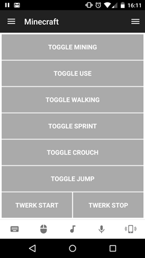

# Minecraft Helper Remote
A simple helper remote for automating Minecraft tasks.

## Features
* Auto Mine (left-click)
* Auto Use (right-click)
* Auto Walk
* Auto Sprint
* Auto Crouch
* Auto Jump
* Auto Twerk (Sky Factory 2 / Trees)

## Requirements
Note that some auto clickers/pressers will stop running if your device screen turns off. You can use the built-in wake lock to prevent this will using the remote.

## Todo
* Add more auto clickers/pressers?

## Screenshots

