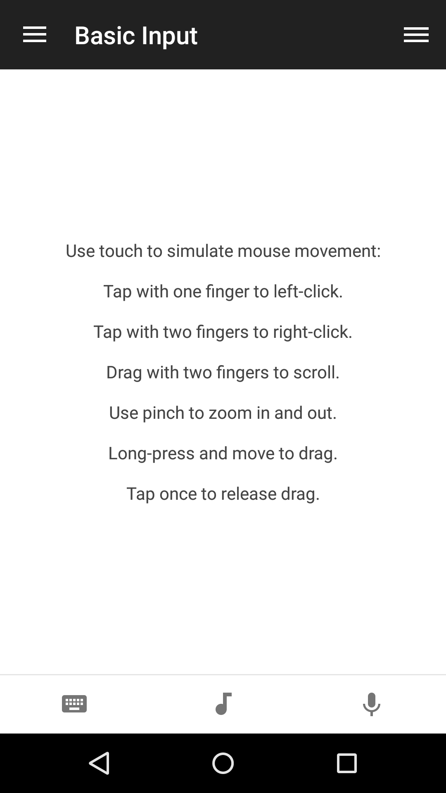

# Basic Input
Control mouse and keyboard. 

## Features
* Tap with one finger to left-click
* Tap with two fingers to right-click
* Drag with two fingers to scroll
* Use pinch to zoom in and out
* Long-press and move to drag
* Tap once to release drag
* Volumer rocker controls computer volume (Android)

## Configuration
The Basic Input remote has several options that can be configured directly from the app. 

**To access the Mouse Preferences:**

1. Open the app menu
2. Preferences / Settings
3. Mouse Settings

**Supported options:**

* Single-touch or multi-touch mode
* Invert scrolling direction
* Swap left and right mouse buttons
* Limit mouse speed (if you're experiencing lag/latency)
* Disable pinch zoom
* Adjust pointer sensitivity
* Adjust scroll sensitivity
* Enable menu swipe when using mouse

## Screenshots

## Support
Remote is developed and maintained by **Unified Remote**  
https://www.unifiedremote.com/help