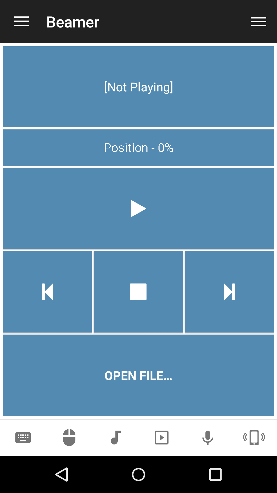

# Beamer
Beamer remote control.

## Features
*  Next movie
*  Previous movie
*  Stop playback
*  Toggle play/pause state
*  Set position

## Platforms
* Mac OSX

## Getting help
Check out our tutorials:  
[https://www.unifiedremote.com/help](https://www.unifiedremote.com/help)

## Screenshots

