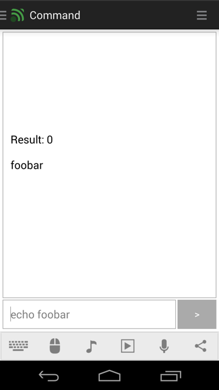

# Command
Execute terminal commands remotely with a lot of power and flexibility. By default the command remote generates a ``batch`` file on Windows and a ``sh`` shell script on Mac and Linux.

## Features
*  Execute commands
*  Remembers last command
*  Shows result code, output, and errors

## Implementation
For maximum flexibility the command remotes generates a temporary script file with the contents written in the remote which is then executed. The default script type can be changed by modifying the remote file (for example if you wish to use PowerShell or AppleScript instead).

## Screenshots

## Support
Developed and maintained by **Unified Remote**  
https://www.unifiedremote.com/help
