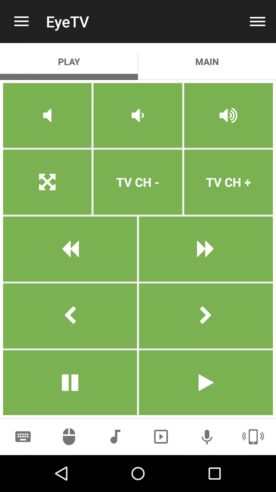

# EyeTV
EyeTV for Mac OS X

## Features
*  Channel down
*  Channel up
*  Close Window
*  Fast basck
*  Fast forward
*  Jump backward
*  Jump forward
*  Lower volume
*  Mute volume
*  Navigate back
*  Navigate down
*  Navigate left
*  Navigate right
*  Navigate up
*  Next item
*  Open menu
*  Pause playback
*  Raise volume
*  Select current item
*  Toggle fullscreen
*  Zoom

## Screenshots

## Support
Developed by **Steve H.**
https://www.unifiedremote.com/help

