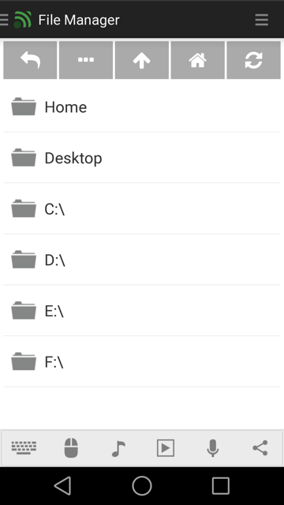
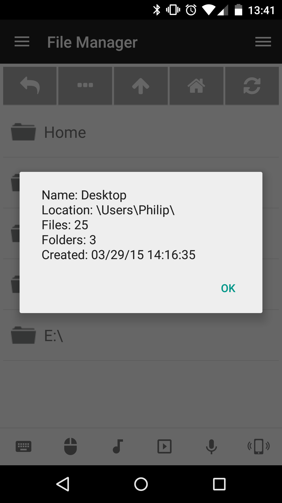

# File Manager
The remote file manager makes it possible to easily browse and open files on your computer. This is especially useful for opening media files (music, videos, etc) or even starting programs. However, for starting programs the [Start (Windows)](../Start), [Launcher (Linux)](../Launcher (Linux)) and [Launcher (Mac)](../Launcher (Mac)) are recommended instead.

## Features
* Browse files and folders
* Go to specific path
* Open file or folder on computer
* Open all files in specified path
* Show file or folder information
* Copy/cut/delete files and folders

## Screenshots

## Support
Developed and maintained by **Unified Remote**  
https://www.unifiedremote.com/help
