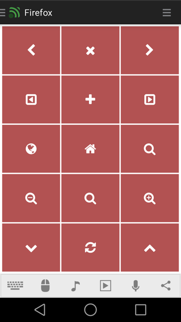

# Firefox
Mozilla Firefox browser remote.

## Features
*  Navigation (back, fowrard, home)
*  Tabs (open, close, next, previous)
*  Find on current page
*  Refresh current page
*  Scroll up/down
*  Zoom in/out
*  Focus URL field

## Getting help
Check out our tutorials:  
[https://www.unifiedremote.com/help](https://www.unifiedremote.com/help)

## Screenshots

