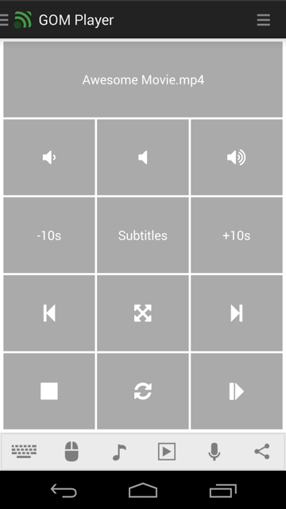

# GOM Player
GOM Player remote control.

## Features
*  Go 10 seconds back
*  Go 10 seconds forward
*  Lower volume
*  Mute volume
*  Next track
*  Pause or unpause playback
*  Previous track
*  Raise volume
*  Start playback
*  Stop playback
*  Toggle fullscreen
*  Toggle play/pause state

## Platforms
* Windows

## Getting help
Check out our tutorials:  
[https://www.unifiedremote.com/help](https://www.unifiedremote.com/help)

## Screenshots

