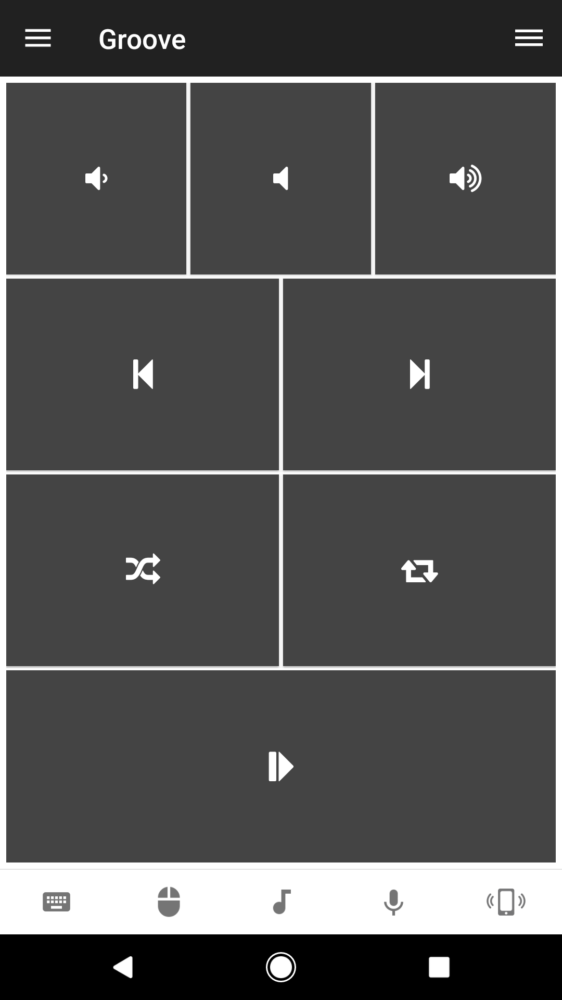

# Groove
Remote control for the Groove Music player in Windows 10.

## Features
*  Volume (up, down, mute)
*  Next & previous track
*  Toggle repeat/shuffle
*  Toggle playback (play, pause)

## Screenshots

## Support
Developed and maintained by **Unified Remote**  
https://www.unifiedremote.com/help
