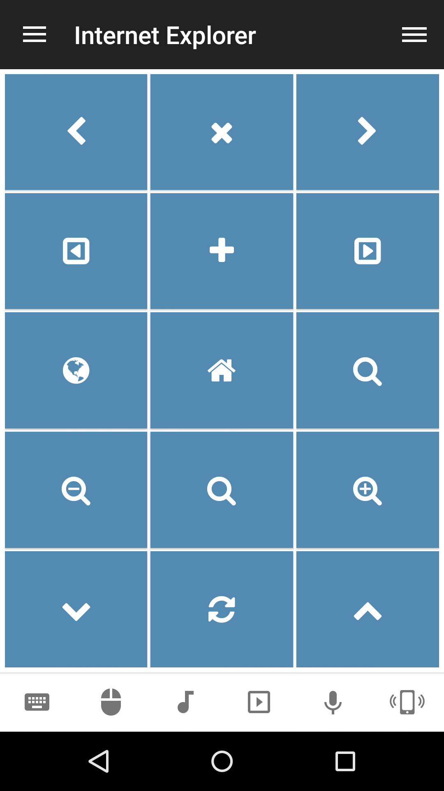

# Internet Explorer
Internet Explorer browser remote.

## Features
*  Navigation (back, fowrard, home)
*  Tabs (open, close, next, previous)
*  Find on current page
*  Refresh current page
*  Scroll up/down
*  Zoom in/out
*  Focus URL field

## Screenshots

## Support
Developed and maintained by **Unified Remote**  
https://www.unifiedremote.com/help

