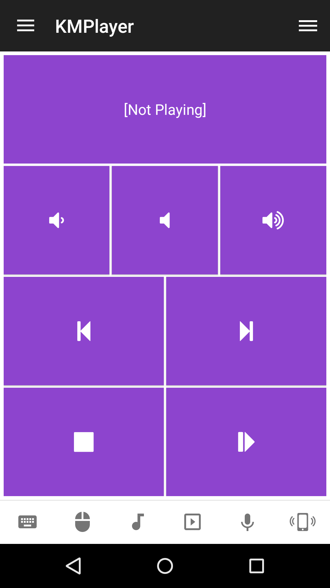

# KMPlayer
KMPlayer remote control.

## Features
*  Update status information
*  Send raw command to Winamp
*  Launcher Winamp application
*  Lower volume
*  Mute volume
*  Raise volume
*  Previous track
*  Next track
*  Stop playback
*  Start playback
*  Pause or unpause playback
*  Toggle play/pause state

## Platforms
* Windows

## Support
Developed and maintained by **Unified Remote**  
https://www.unifiedremote.com/help

## Screenshots
