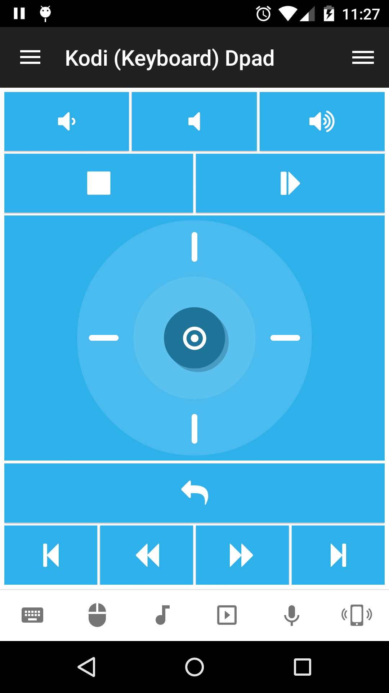

# Kodi (Keyboard) Dpad
Kodi keyboard remote with dpad.

## Features
*  Launch Kodi application
*  Focus Kodi application
*  Start playback
*  Pause playback
*  Toggle play/pause
*  Raise volume
*  Lower volume
*  Toggle mute volume
*  Navigate up
*  Navigate left
*  Navigate down
*  Navigate right
*  Select current item
*  Stop playback
*  Play previous item
*  Play next item
*  Rewind
*  Fast forward
*  Navigate back

## Screenshots

## Support
Developed and maintained by **Unified Remote**  
https://www.unifiedremote.com/help
