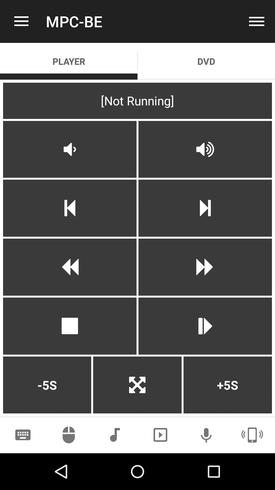
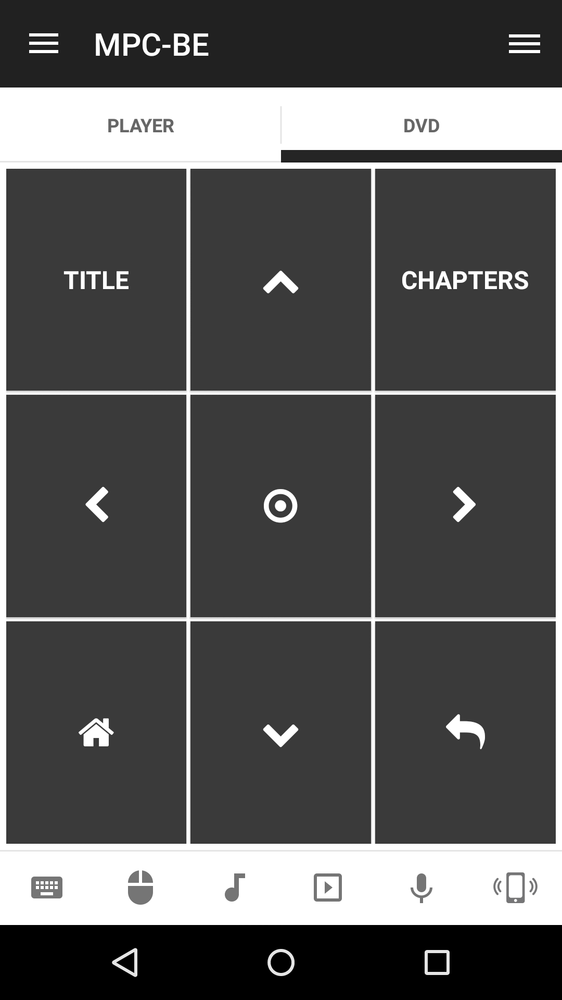

# MPC-BE
Media Player Classic Black Edition Remote.

## Features
*  Forward/Rewind track
*  Fullscreen
*  Go to Home
*  Jump Back 5s
*  Jump Forward 5s
*  Launch MPCBE application
*  Move back
*  Move up/down/left/right
*  Mute Volume
*  Next/Prevous track
*  Open chapters
*  Open title
*  Play/Pause/Stop track
*  Run command
*  Select
*  Volume up/down

## Screenshots

## Support
Developed and maintained by **Unified Remote**  
https://www.unifiedremote.com/help