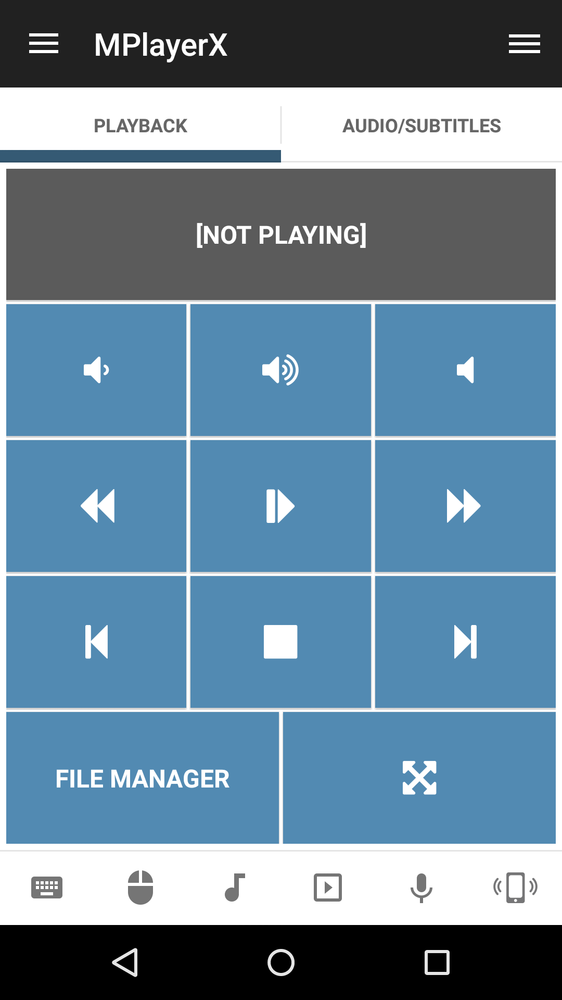

# MPlayerX
MPlayerX remote control.

## Features
*  Lower/Raise/Mute volume
*  Next/Previous track
*  Skip forward/backward 10 secs
*  Stop/Start/Pause playback
*  Switch subtitle
*  Toggle fullscreen
*  Increase/Decrease subtitle delay
*  Increase/Decrease audio delay

## Screenshots

## Support
Developed and maintained by **Unified Remote**  
https://www.unifiedremote.com/help