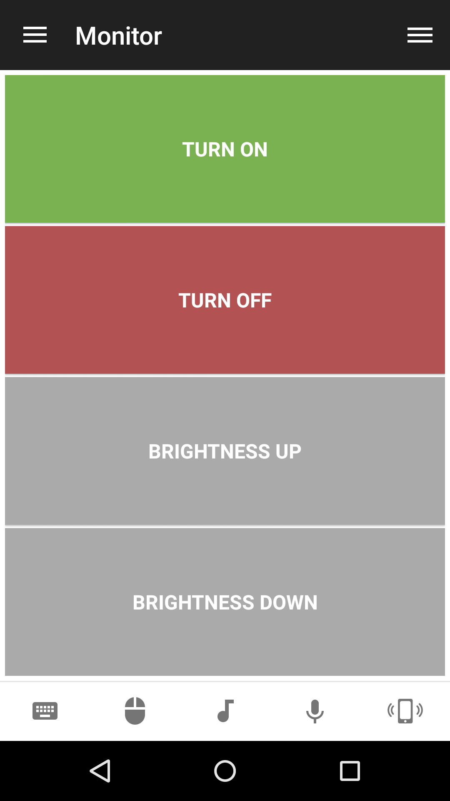

# Monitor
Control your monitor power.

## Features
*  Wake up monitor
*  Put monitor to sleep
*  Raise brightness
*  Lower brightness
*  Turn monitor on
*  Turn monitor off
*  Put monitor in standby
*  Duplicate desktop on multiple displays
*  Extend desktop on multiple displays
*  Display projector only
*  Display computer only

## Screenshots

## Support
Developed and maintained by **Unified Remote**  
https://www.unifiedremote.com/help