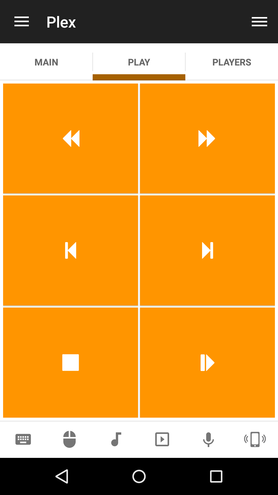

# Plex
Control Plex Media Server

## Features
*  Navigate up/down/left/right
*  Navigate page up/down
*  Play/Pause/Stop track
*  Forwad/Rewind track
*  Step forward/back in track
*  Big step forward /back in track
*  Next/Previous track

## Screenshots

## Support
Developed and maintained by **Unified Remote**  
https://www.unifiedremote.com/help