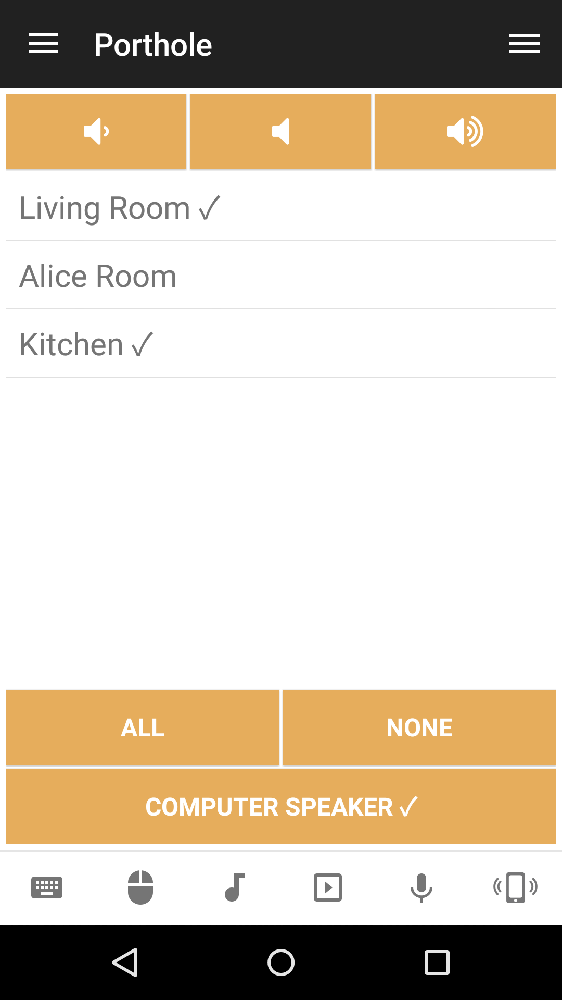

# Porthole
Porthole is an app for Mac that lets you play all audio from your Mac through multiple AirPlay speakers at the same time. This remote makes it possible to control Porthole from Unified Remote.

## Features
*  Toggle AirPlay speaker(s)
*  Show status information
*  Connect to all available speaker
*  Disconnect from all available speaker
*  Toggle use of the computer's speaker
*  Change system volume

## Screenshots

## Support
Developed and maintained by **Porthole**  
http://www.getporthole.com/
