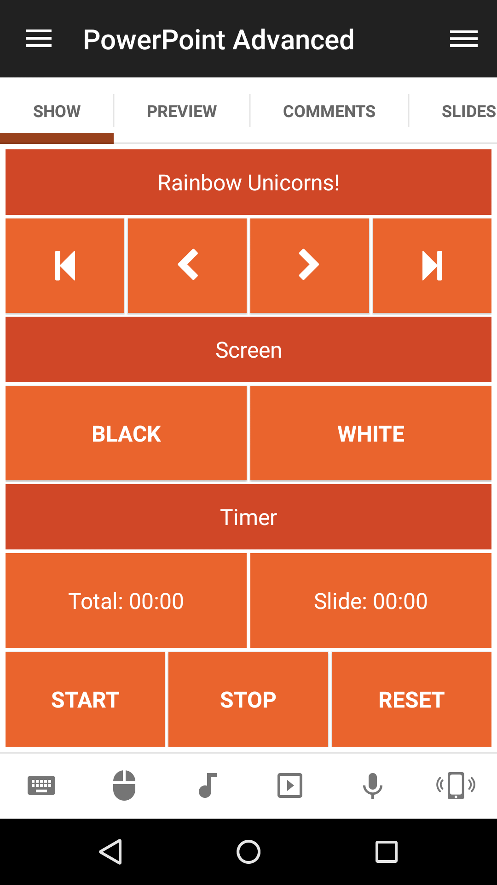

# PowerPoint Advanced
Power Point Advanced Remote.

## Features
*  Go to next/previous/first/last/slide
*  Start/stop/reset timer
*  Set screen to black/white
*  Start/end slide show presentation

## Screenshots

  

## Support
Developed and maintained by **Unified Remote**  
https://www.unifiedremote.com/help