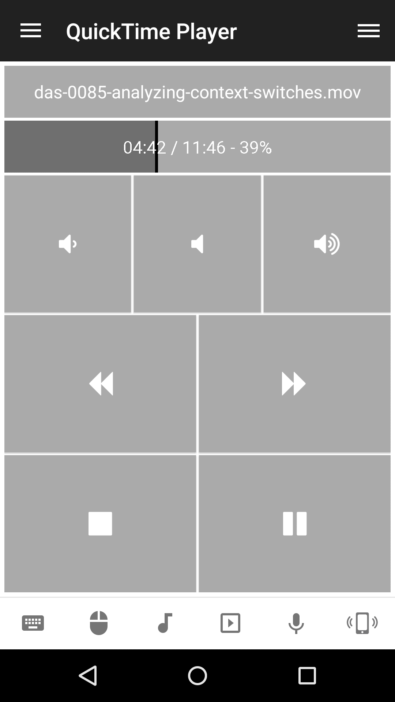

# QuickTime Player
Remote control for QuickTime player.

## Features
*  Toggle play/pause
*  Start/Pause/Stop playback
*  Seek forwards/backwards
*  Raise/Lower volume
*  Toggle mute volume
*  Seek to position

## Screenshots

## Support
Developed and maintained by **Unified Remote**  
https://www.unifiedremote.com/help