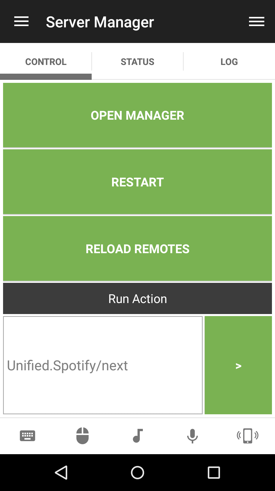
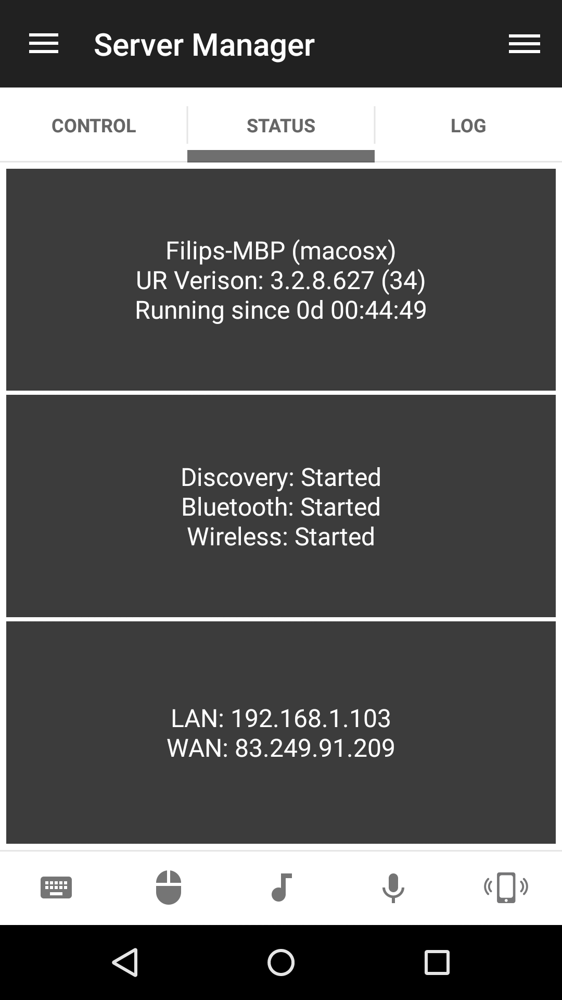
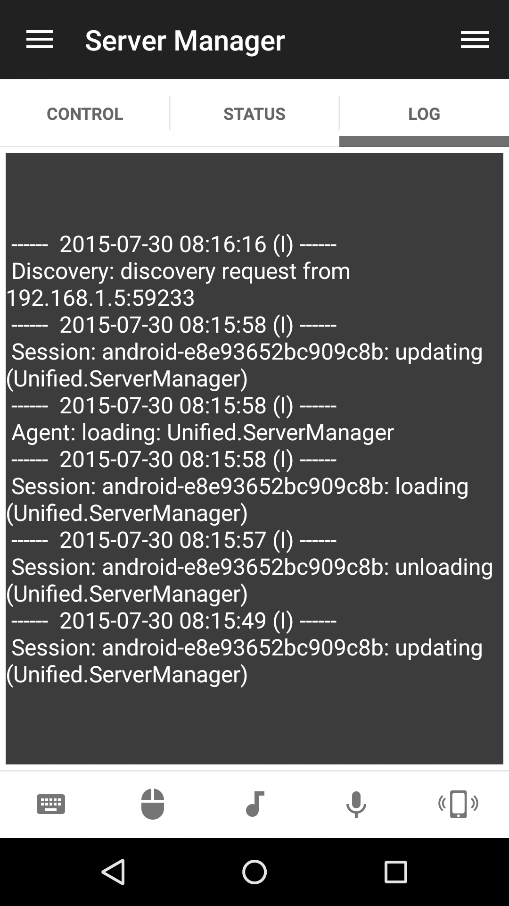

# Server Manager
Control the Unified Remote server manager

## Features
* Restart server
* Reload remotes
* Open manager
* Send server action

## Screenshots

## Support
Developed and maintained by **Unified Remote**  
https://www.unifiedremote.com/help