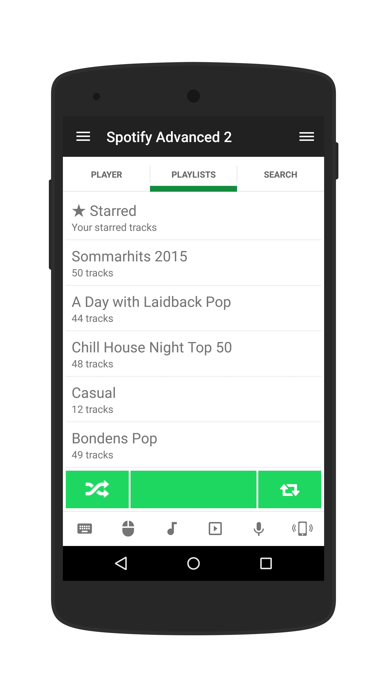

# Spotify Advanced
This version of the Spotify remote includes advanced features such as playlists and search.

## Features
 * Current playing information
 * Cover art
 * Volume and position sliders
 * Playlists
 * Search

## Requirements
 * A Spotify account
 * Server 3.2.8 (627) or later

## Setup
To access playlists and search in an efficient manner you must now connect your Spotify account to the Unified Remote Server.

1. Open manager: http://localhost:9510/web
2. Click the "Accounts" tab
3. Click "Connect Spotify"
4. Follow the on-screen instructions
5. Once logged in you can start using the remote in the app

## Implementation
The Spotify Advanced remote is one of the most advanced remotes created using Unified Remote. It uses many different techniques to accomplish all of the different remote control aspects. Such as:

* Communicates with the "Spotify Webhelper" to extract current state
* Uses the Spotify Search API
* Uses the Spotify Account API
* Uses AppleScript to control Spotify on Mac
* Uses ``SendMessage`` with ``WM_APPCOMMAND`` on Windows
* Simulates clicks and key presses on Windows
* Uses native winapi to find the Spotify window

We've been unable to find an "elegant" way of controlling the volume and position on Windows. The current solution simulates clicks in the Spotify window at the correct "offsets" on the sliders. It works, but breaks whenever Spotify changes the window layout.