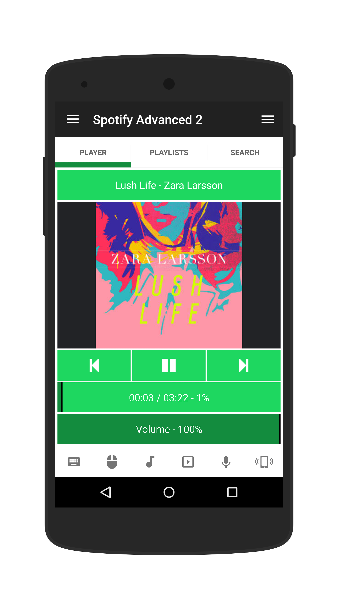
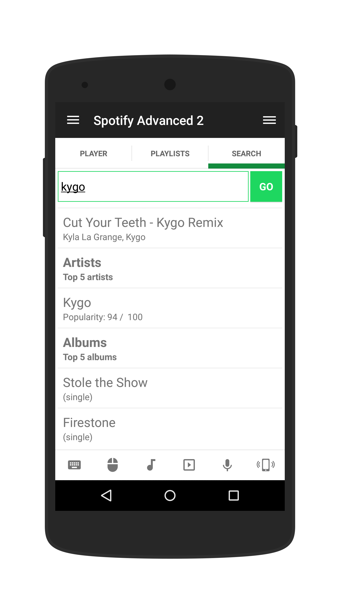
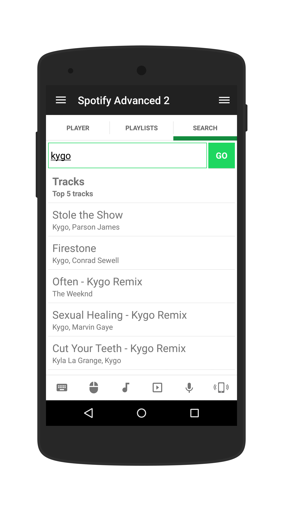

# Spotify Advanced 2
Updated version of the Spotify Advanced remote.

## Features
 * Better search
 * Playlists working again
 * Improved responsiveness

## Requirements
 * A Spotify account
 * Latest Server 3.2.8 (627)

## Setup
 * Install the remote with drag 'n' drop to the server manager.
 * Go to Status > Accounts > Connect Spotify

