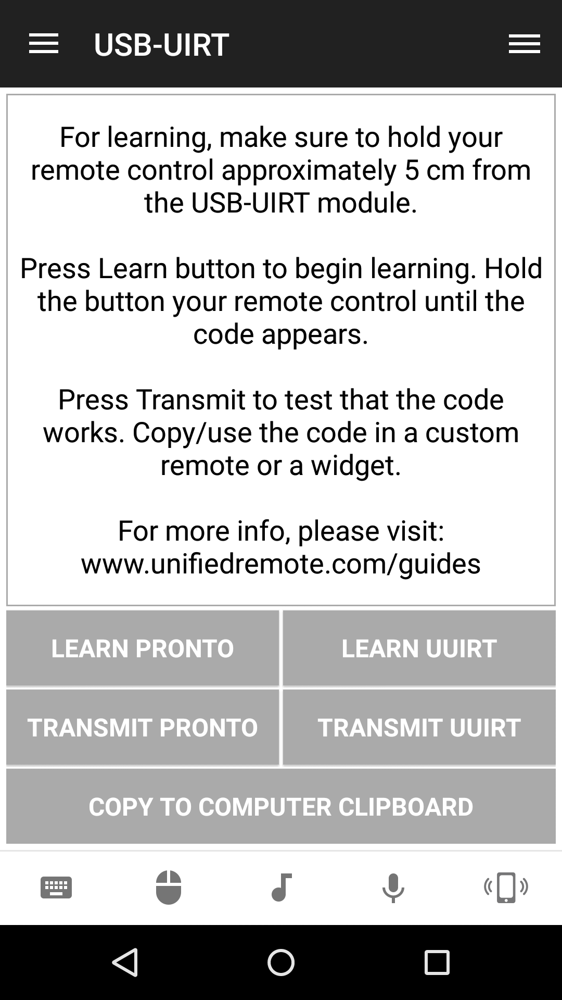
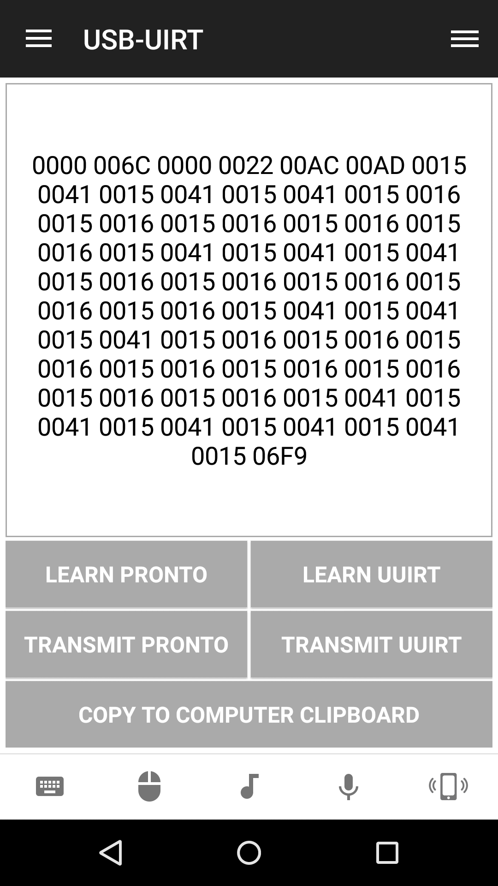
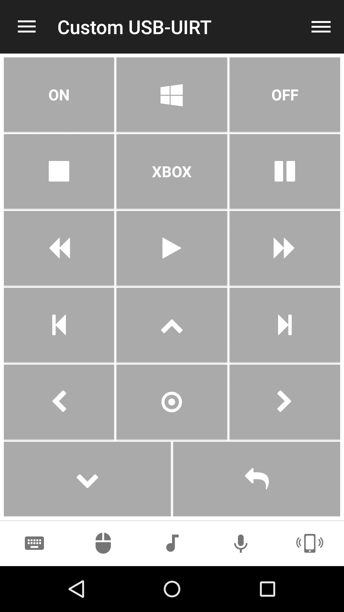

# USB-UIRT
If you have an USB-UIRT device, then you can create a custom remote for controlling TVs, sound systems, or other devices that can be controlled using IR. Helper remote for USB-UIRT.

## Features
*  Learn code
*  Transmit code
*  Learn code (Pronto format)
*  Learn code (UUIRT format)
*  Transmit saved code (Pronto format)
*  Transmit saved code (UUIRT format)
*  Transmit code to computer clipboard
*  Transmit UUIRT code
*  Transmit Pronto code

## Tutorials
Setup your USB-UIRT device using [How To Install USB-UIRT](https://www.unifiedremote.com/tutorials/how-to-install-usbuirt).
Checkout the [How To Create a Custom Remote for USB-UIRT](https://www.unifiedremote.com/tutorials/how-to-create-a-custom-remote-for-usbuirt) tutorial, on how create a custom IR remote for your TV. 

## Platforms
* Windows

## Screenshots

## Support
Developed and maintained by **Unified Remote**  
https://www.unifiedremote.com/help