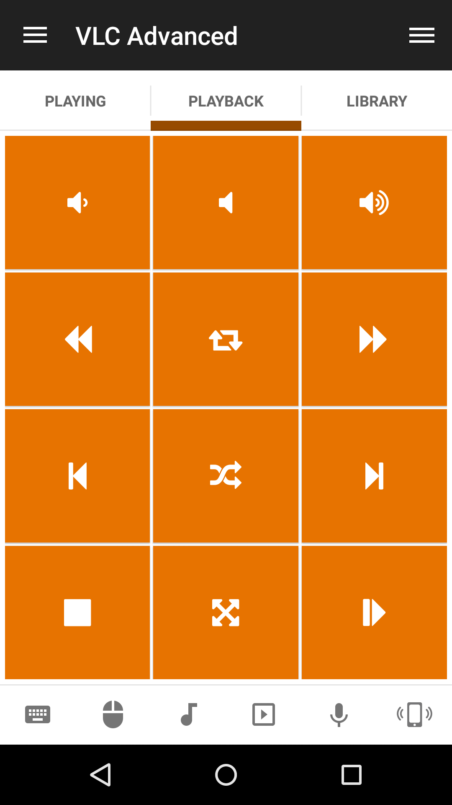
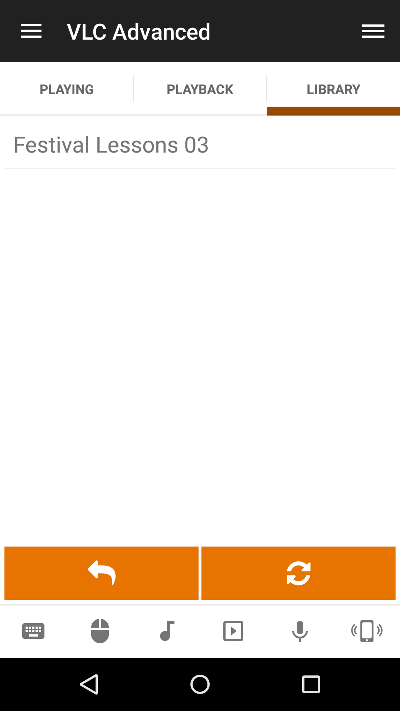

# VLC Advanced
VLC web interface remote.

## Features
*  Change position
*  Seek forwards/Seek backwards
*  Toggle play/pause
*  Start/Resume/Pause/Stop playback
*  Play next/previous item
*  Toggle shuffle/loop/repeat
*  Raise/Lower/Mute volume
*  Toggle fullscreen

## Screenshots

## Support
Developed and maintained by **Unified Remote**  
https://www.unifiedremote.com/help