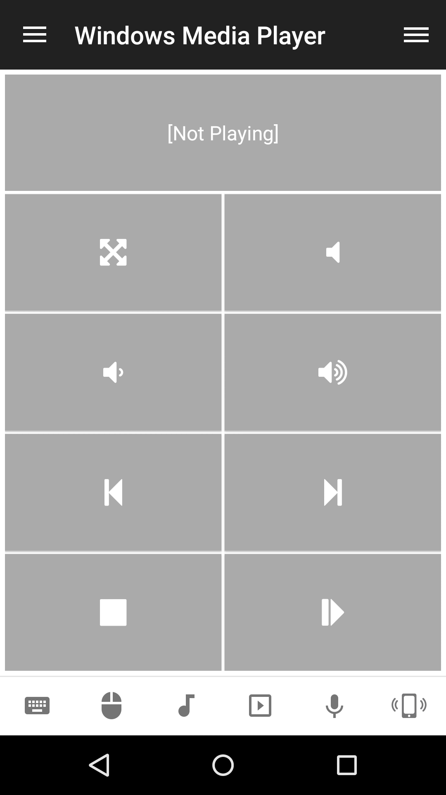

# Windows Media Player
Windows Media Player remote control.

## Features
*  Toggle fullscreen
*  Raise/lower/mute volume
*  Next/previous track
*  Toggle play/pause/stop

## Platforms
* Windows

## Screenshots

## Support
Developed and maintained by **Unified Remote**  
https://www.unifiedremote.com/help