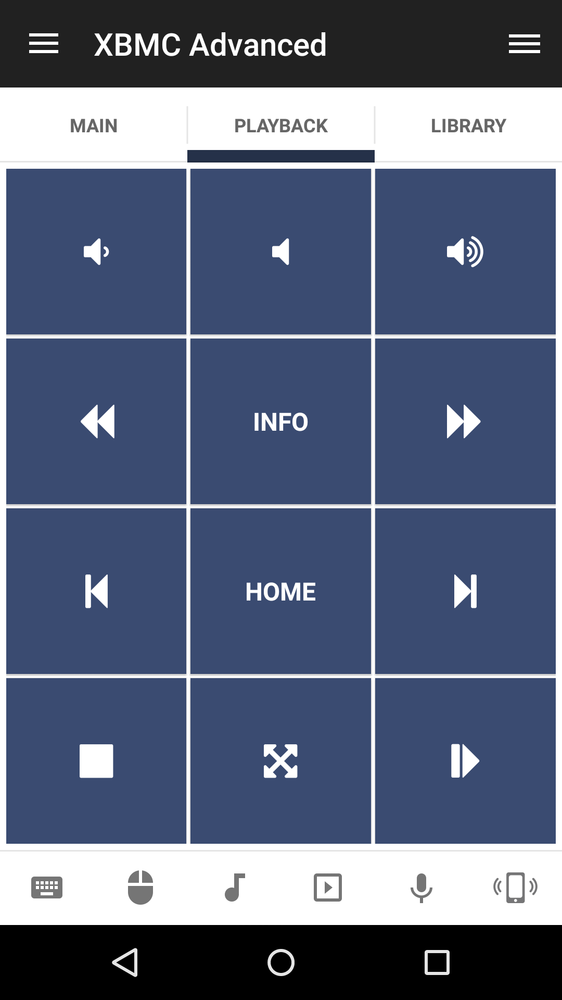
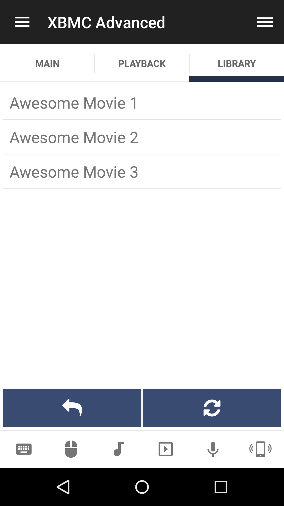

# XBMC Advanced
XBMC web interface remote.

## Features
*  Toggle play/pause/stop
*  Raise/lower/mute volume
*  Navigate up/left/right/down
*  Select current item
*  Play next/previous item
*  Fast forward/rewind
*  Toggle context menu/OSD/fullscreen/information
*  Navigate home

## Screenshots

## Support
Developed and maintained by **Unified Remote**  
https://www.unifiedremote.com/help