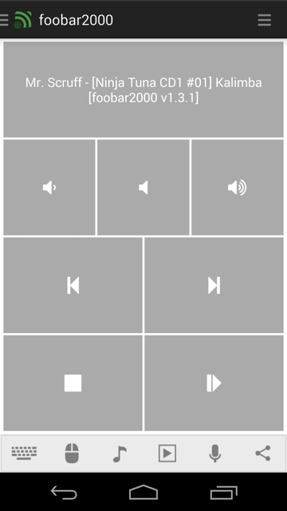

# foobar2000
foobar2000 media remote

## Features
*  Launch program
*  Lower volume
*  Mute volume
*  Next track
*  Previous track
*  Raise volume
*  Stop playback
*  Toggle playback state
*  Set playback order

## Screenshots

## Support
Developed and maintained by **Unified Remote**  
https://www.unifiedremote.com/help
