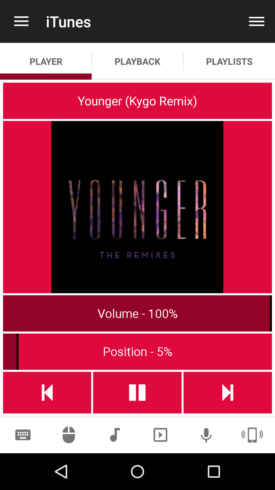

# iTunes
iTunes Remote.

## Features
*  Fullscreen
*  Next/Previous track
*  Play/Pause track
*  Set Repeate/Shuffle
*  Toggle Play/Pause
*  Volume Up/Down/Mute

## Screenshots

## Support
Developed and maintained by **Unified Remote**  
https://www.unifiedremote.com/help
